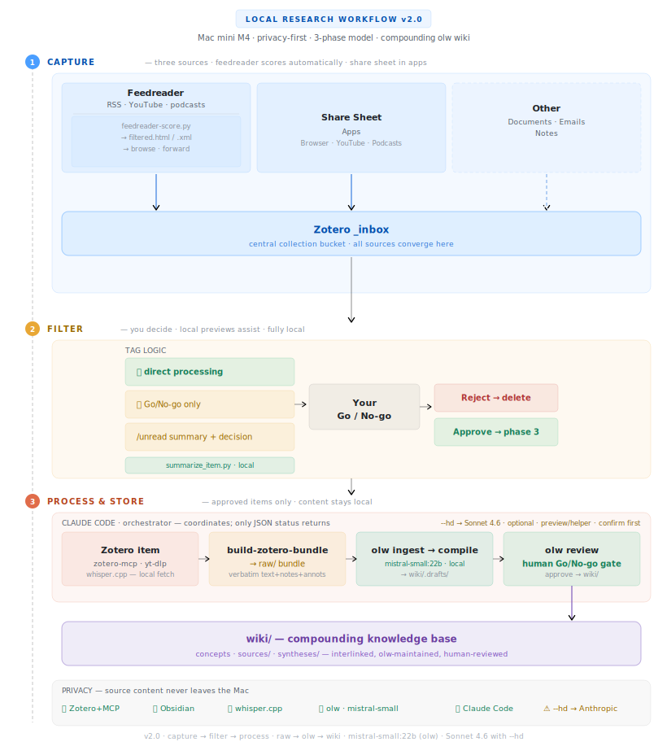

# ResearchVault

A privacy-first workflow that turns documents, videos, podcasts, and RSS feeds into a self-compounding knowledge wiki — with fully local AI and no cloud storage for your research data. Designed for a Mac with Apple Silicon.

The knowledge layer follows Andrej Karpathy's idea of a *compounding* LLM-maintained wiki: instead of one note per source, a local model synthesizes your sources into interlinked concept pages that grow richer as related material accumulates. It is built on [olw (obsidian-llm-wiki)](https://github.com/kytmanov/obsidian-llm-wiki).

---

## The 3-phase model

Every source — paper, podcast, video, RSS article — passes through three explicit phases:

| Phase | Goal | How |
|---|---|---|
| **1 — Cast wide** | Capture from three sources into Zotero `_inbox` | **Feedreader** — `feedreader-score.py` runs daily, scores RSS/YouTube/podcast items by semantic similarity to your library, and produces a filtered HTML reader and Atom feed at `http://localhost:8765/filtered.html`; interesting items go to `_inbox` via browser extension or iOS app · **Share sheet** — content you've already consumed in apps (browser, YouTube, podcasts) goes directly to `_inbox` via the iOS share sheet · **Other** — documents, emails, and notes added manually |
| **2 — Filter** | You decide what enters the vault | `index-score.py` ranks inbox items by semantic similarity to your existing library; `summarize_item.py` generates a short preview per item; you give a **Go** or **No-go** |
| **3 — Process** | Approved items become wiki knowledge | On **Go**, `build-zotero-bundle.py` writes a canonical bundle to `raw/`; **olw** then ingests it and compiles interlinked concept pages, which you approve through `olw review` — the human quality gate — before they publish to `wiki/` |

The explicit filter step between capture and processing keeps both your feed reader and your vault clean: only sources you have consciously approved end up in the vault, and your feed reader only shows items that are likely relevant.

<picture>
  <source media="(prefers-color-scheme: dark)" srcset="assets/architecture-diagram-dark.svg">
  
</picture>

---

## Tools required

| Tool | Role | Local / Cloud |
|---|---|---|
| [Zotero](https://www.zotero.org) | Reference manager and central inbox | Local |
| [Zotero MCP](https://github.com/zotero-mcp) | Connects Claude Code to your Zotero library via local API | Local |
| [Obsidian](https://obsidian.md) | Markdown-based note-taking and knowledge base | Local |
| [olw (obsidian-llm-wiki)](https://github.com/kytmanov/obsidian-llm-wiki) | Ingests source bundles and compiles them into an interlinked concept wiki (`olw ingest` / `compile` / `review`); runs `mistral-small:22b` locally | Local |
| [Ollama](https://ollama.ai) | Local language model server (default backend); serves `mistral-small:22b` for olw and the fallback scripts | Local |
| [mlx-lm](https://github.com/ml-explore/mlx-examples/tree/main/llms) | Apple Silicon-native LLM server (optional MLX backend; set `LLM_BACKEND=mlx`) | Local |
| [yt-dlp](https://github.com/yt-dlp/yt-dlp) | Download YouTube transcripts and podcast audio | Local |
| [youtube-transcript-api](https://github.com/jdepoix/youtube-transcript-api) | Fast transcript fetching for feedreader YouTube scoring (no video download) | Local |
| [whisper.cpp](https://github.com/ggerganov/whisper.cpp) | Local speech-to-text transcription for podcasts | Local |
| [NetNewsWire](https://netnewswire.com) | RSS reader subscribed to the feedreader filtered feed | Local |
| [Claude Code](https://claude.ai/claude-code) | AI assistant that orchestrates the workflow (intake, the review gate, publishing); the synthesis itself runs locally via olw | Local (default) / Cloud API with `--hd` |

In standard mode, only orchestration instructions are sent to the Anthropic API; the actual synthesis is done locally by olw running `mistral-small:22b`. The default backend is Ollama; set `LLM_BACKEND=mlx` in `ResearchVault/.env` to use the MLX backend instead (Apple Silicon-native, no separate server binary). olw always runs locally; only the optional `--hd` flag on the preview/helper scripts sends a prompt and source content to the Anthropic API (Claude Sonnet 4.6), and only after you confirm. Reference data, notes, and transcriptions always stay local.

---

## Vault structure

```
ResearchVault/
├── raw/              # Canonical source bundles (one per Zotero item) — input for olw
│   └── notes/        # Promoted snapshots of your own mature notes (source_type: personal)
├── wiki/             # olw-generated knowledge base
│   ├── sources/      # Per-source pages
│   ├── syntheses/    # Thematic syntheses across multiple sources
│   └── .drafts/      # Pending review (the olw review queue)
├── notes/            # Personal and working notes
├── inbox/            # Raw / temporary input awaiting processing
├── wiki.toml         # olw configuration (model, context window, review gate)
├── CLAUDE.md         # Workflow instructions for Claude Code
└── .claude/
    ├── build-zotero-bundle.py # Go → canonical bundle in raw/ (input for olw)
    ├── promote-to-raw.py      # Promote a mature personal note → raw/notes/
    ├── index-score.py         # Relevance scoring for _inbox items (phase 2)
    ├── summarize_item.py      # Privacy-preserving subagent: item key → compact preview for Go/No-go
    ├── fetch-fulltext.py      # Fetch Zotero attachment text to a local file (no content returned)
    ├── ollama-generate.py     # Call local LLM (Ollama or MLX) and write output to file (fallback helper)
    ├── zotero-inbox.py        # List all items in Zotero _inbox (human-readable or JSON)
    ├── zotero_utils.py        # Shared Zotero SQLite helpers (make_sqlite_copy, get_library_keys_with_weights)
    ├── feedreader-score.py    # RSS feed scoring and filtered feed generation (feedreader)
    ├── feedreader_core.py     # Shared scoring functions (cosine similarity, profile, source type detection)
    ├── feedreader-server.py   # Local HTTP server (port 8765) + inbox-review API
    ├── feedreader-learn.py    # Learning loop: processes skip queue + threshold calibration
    ├── feedreader-list.txt    # List of RSS feed URLs (web, YouTube, podcast)
    ├── score_log.jsonl        # Running log of scored feed items (incl. source_type, skipped flag)
    ├── skip_queue.jsonl       # Queue of explicitly rejected items (👎); processed daily
    ├── transcript_cache/      # Transcript & show-notes cache (YouTube: {video_id}.json; podcast: podcast_{episode_id}.json)
    └── skills/
        └── SKILL.md  # Workflow skill (loaded each session)
```

---

## Daily use (summary)

**The feedreader runs automatically** — `feedreader-score.py` is triggered on a schedule, scores all feeds in `feedreader-list.txt`, and updates the filtered feed at `http://localhost:8765/filtered.html`. No manual action required.

**Your daily session:**

1. Browse the filtered feed at `http://localhost:8765/filtered.html` (or in NetNewsWire via `http://localhost:8765/filtered.xml`). Items are sorted by relevance score; interesting ones go to Zotero `_inbox` via the browser extension or iOS app.
2. Open Terminal, navigate to your vault, and start Claude Code:
   ```bash
   cd ~/Documents/ResearchVault
   claude
   ```
3. Activate the research workflow:
   ```
   /research
   ```
   or just type: `start research workflow`
4. Optionally, run `index-score.py` first to prioritize your review:
   ```bash
   ~/.local/share/uv/tools/zotero-mcp-server/bin/python3 .claude/index-score.py
   ```
   This ranks all `_inbox` items by semantic similarity to your existing library (using the ChromaDB embeddings from zotero-mcp), so you know which items to focus on.
5. Claude Code retrieves all items from your Zotero `_inbox` and presents each one with a short preview and relevance assessment — the preview is generated locally. You respond **Go** or **No-go** per item.
6. For each **Go**: Claude Code writes a canonical bundle to `raw/` via `build-zotero-bundle.py`, and olw ingests it. You then run `olw compile` to draft the concept pages and `olw review` to approve them into `wiki/` (the human quality gate).
7. For each **No-go**: Claude Code removes the item from `_inbox` (after your confirmation).
8. At the end of the session, Claude Code shows a summary: X approved, Y removed. The Zotero semantic search database is refreshed automatically. If you process items later and want the database to reflect them immediately, run:
   ```bash
   zotero-mcp update-db --fulltext # recommended (includes full text, 5–20 min on Apple Silicon)
   ```
   Or use the alias: `update-zotero`. Check database status with `zotero-mcp db-status`.

---

## Getting started

Full step-by-step instructions covering all tools, configuration, and the first test run are published interactively at **[pjastam.github.io/ResearchVault](https://pjastam.github.io/ResearchVault/)**.

To configure Claude Code's permission settings for this vault, run the setup script from your vault directory:

```bash
./setup.sh
```

The script auto-detects your home path and asks for your Zotero library ID (found via `zotero-mcp setup-info`).

---

## Privacy

- Your Zotero library and Obsidian vault stay entirely on your own machine
- The Zotero local API is only accessible via `localhost`
- Transcription (whisper.cpp) and all synthesis (olw, running `mistral-small:22b` via Ollama or MLX) run fully offline
- In standard mode, only orchestration instructions reach the Anthropic API; source content stays local
- With `--hd` on the optional preview/helper scripts, the prompt and source content are sent to the Anthropic API (Claude Sonnet 4.6) — after confirmation
- For a fully local orchestration alternative, see [Step 14: Future perspective — local orchestrator](https://pjastam.github.io/ResearchVault/extensions/future-orchestrator.html)

---

## Frequently asked questions

1. Does content go to the cloud?

In the default mode: no. Claude Code orchestrates the workflow, but all content-heavy work is delegated to local tools: `build-zotero-bundle.py` receives only a Zotero item key, fetches the full text locally, and writes a canonical bundle to `raw/`; **olw** then reads that bundle and compiles the wiki pages locally with `mistral-small:22b`. Claude Code receives only JSON status objects and counts — never the source or generated text. Nothing you research reaches Anthropic's servers. Only when you explicitly add `--hd` to a preview/helper script does source content go to the Anthropic API — and Claude Code asks for confirmation first.

2. Do you need a paid Claude subscription?

Partially yes — Claude Code needs an Anthropic account (paid subscription or API credits) for its orchestration role. But the AI that actually reads and synthesizes your research is `mistral-small:22b` running locally (via olw on Ollama or MLX), which is completely free and open source. So the heavy lifting costs nothing.

3. "No data leaks" — is that accurate?

Yes, substantially. In default mode no vault content, paper, transcript, or note leaves your local machine. The privacy claim holds up in this sense.

---

## License

MIT — feel free to adapt this workflow for your own research setup.
