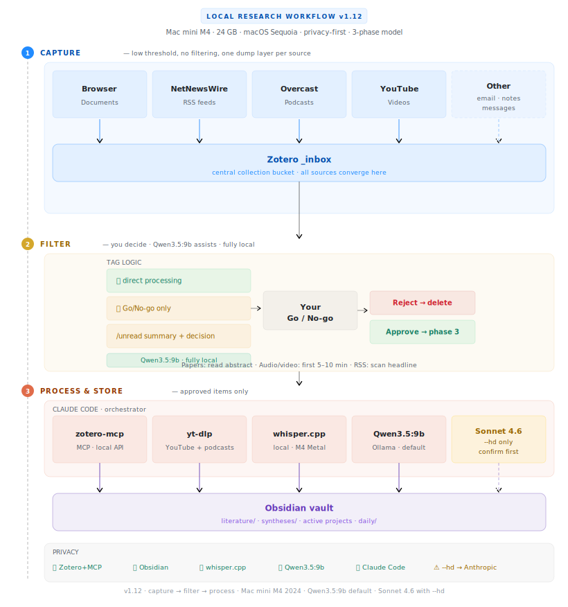

# ResearchVault

A privacy-first workflow for processing documents, videos, podcasts, and RSS feeds with local AI. Designed for a Mac with Apple Silicon; no cloud storage for your research data.

---

## The 3-phase model

Every source — paper, podcast, video, RSS article — passes through three explicit phases:

| Phase | Goal | How |
|---|---|---|
| **1 — Cast wide** | Capture everything, no filtering yet | All sources flow into a single Zotero `_inbox` collection via browser extension, iOS app, or RSS reader |
| **2 — Filter** | You decide what enters the vault | Qwen3.5:9b (local) generates a 2–3 sentence summary per inbox item; you give a **Go** or **No-go** |
| **3 — Process** | Full processing of approved items | Claude Code writes a structured literature note to the Obsidian vault, including key findings, methodology notes, relevant quotes, and flashcards for spaced repetition |

The separation between phases 1 and 3 keeps the vault clean: only sources you have consciously approved end up there.

<picture>
  <source media="(prefers-color-scheme: dark)" srcset="assets/architecture-diagram-v1.12-dark.svg">
  
</picture>

---

## Tools required

| Tool | Role | Local / Cloud |
|---|---|---|
| [Zotero](https://www.zotero.org) | Reference manager and central inbox | Local |
| [Zotero MCP](https://github.com/zotero-mcp) | Connects Claude Code to your Zotero library via local API | Local |
| [Obsidian](https://obsidian.md) | Markdown-based note-taking and knowledge base | Local |
| [Ollama](https://ollama.ai) | Local language model for offline tasks | Local |
| [yt-dlp](https://github.com/yt-dlp/yt-dlp) | Download YouTube transcripts and podcast audio | Local |
| [whisper.cpp](https://github.com/ggerganov/whisper.cpp) | Local speech-to-text transcription for podcasts | Local |
| [NetNewsWire](https://netnewswire.com) | RSS reader for academic and non-academic feeds | Local |
| [Claude Code](https://claude.ai/claude-code) | AI assistant that orchestrates the workflow; generative work runs locally via Qwen3.5:9b (Ollama) | Local (default) / Cloud API with `--hd` |

In standard mode, only orchestration instructions are sent to the Anthropic API; all generative work is handled locally by Qwen3.5:9b. Only when `--hd` is explicitly requested do the prompt and source content go to the Anthropic API (Claude Sonnet 4.6). Reference data, notes, and transcriptions always stay local.

---

## Vault structure

```
ResearchVault/
├── literature/       # One note per approved source
├── syntheses/        # Thematic syntheses across multiple sources
├── projects/         # Project-specific documentation
├── daily/            # Daily notes and log
├── inbox/            # Raw input awaiting processing
├── CLAUDE.md         # Workflow instructions for Claude Code
└── .claude/
    └── skills/       # Research workflow skill loaded each session
```

---

## Daily use (summary)

1. Start Zotero
2. Open Terminal, navigate to your vault, and start Claude Code:
   ```bash
   cd ~/Documents/ResearchVault
   claude
   ```
3. Activate the research workflow:
   ```
   /research
   ```
   or just type: `start research workflow`
4. Claude Code retrieves all items from your Zotero `_inbox` and presents each one with a short summary and relevance assessment — the summary is generated locally by Qwen3.5:9b. You respond **Go** or **No-go** per item.
5. For each **Go**: Claude Code moves the item to the correct Zotero collection and writes a structured literature note in `literature/`.
6. For each **No-go**: Claude Code removes the item from `_inbox` (after your confirmation).
7. At the end of the session, Claude Code shows a summary: X approved, Y removed. If new papers were added, update the semantic search database. Use the quick version for metadata only, or the recommended full version for much better search results (5–20 min on Apple Silicon):
   ```bash
   zotero-mcp update-db            # quick (metadata only)
   zotero-mcp update-db --fulltext # recommended (includes full text)
   ```
   Or use the alias: `update-zotero` (equivalent to `--fulltext`). Check database status with `zotero-mcp db-status`.

---

## Getting started

Full step-by-step instructions covering all tools, configuration, and the first test run are published interactively at **[pjastam.github.io/ResearchVault](https://pjastam.github.io/ResearchVault/)**. A single-file download is also available: [installation-guide-v1.12.md](docs/installation-guide-v1.12.md).

To configure Claude Code's permission settings for this vault, run the setup script from your vault directory:

```bash
./setup.sh
```

The script auto-detects your home path and asks for your Zotero library ID (found via `zotero-mcp setup-info`).

---

## Privacy

- Your Zotero library and Obsidian vault stay entirely on your own machine
- The Zotero local API is only accessible via `localhost`
- Transcription (whisper.cpp) and local model inference (Ollama) run fully offline
- In standard mode, only orchestration instructions reach the Anthropic API; source content stays local
- With `--hd`, the prompt and source content are sent to the Anthropic API (Claude Sonnet 4.6)
- For a fully local orchestration alternative, see [Step 15: Future perspective — local orchestrator](https://pjastam.github.io/ResearchVault/extensions/future-orchestrator.html)

---

## Frequently asked questions

1. Does content go to the cloud?

In the default mode: no. Claude Code orchestrates the workflow, but the actual generative work — summaries, literature notes, flashcards — is done by Qwen3.5:9b running locally via Ollama. Source content is piped directly to Ollama via bash (ollama run qwen3.5:9b < file.txt), so it never enters Claude Code's context and never reaches Anthropic's servers. Only when you explicitly add --hd does source content go to the Anthropic API — and Claude Code asks for confirmation first.                                                    

2. Do you need a paid Claude subscription?

Partially yes — Claude Code needs an Anthropic account (paid subscription or API credits) for its orchestration role. But the AI that actually reads and processes your research is Ollama + Qwen3.5:9b, which is completely free and open source. So the heavy lifting costs nothing.

3. "No data leaks" — is that accurate?

Yes, substantially. In default mode no vault content, paper, transcript, or note leaves your local machine. The privacy claim holds up in this sense.

---

## License

MIT — feel free to adapt this workflow for your own research setup.
